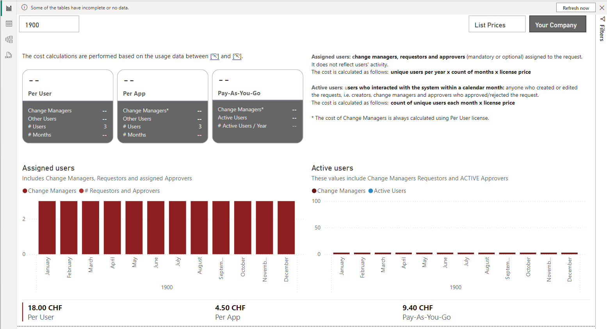

# Power Platform Cost Estimates

Using Microsoft Power Platform for application modernization not only reduces Total Cost of Ownership (TCO) but also helps minimize technology debt.

Unlike traditional coding approaches, low-code solutions require fewer resources for maintenance and accumulate less technical debt, as the platform provides the necessary infrastructure. Power FX, despite its ongoing evolution, remains backward compatible and utilizes a "backward compatibility converter" that automatically adjusts formulas if an incompatible change is detected.

However, depending on the complexity of the application, specific features, and the resources being connected, you may need to purchase premium licenses.
If you're modernizing an existing application and have access to reference data, you can estimate the licensing costs by analyzing historical usage.

## The report

### License Cost Estimation
The License Cost Estimation page provides cost estimates based on the assumption that all users have the same type of license.
For the Per User and Per App estimates, the total number of unique users per year is considered. In the case of PAYG (Pay-As-You-Go), the count is based on version history, covering all users who have created or edited items during a specific calendar month, excluding readers.

The number of months for which data is available is shown on the cards. If the data does not cover the full year, the yearly user count or cost is not extrapolated.

### License Cost Optimization

A threshold is calculated to estimate the maximum number of months a user should access the app for PAYG to remain cost-effective. This is determined by comparing the costs:  `(number of Months x 1 User x PAYG) < (12 Months x 1 User x Per App)`.

The simulation assigns less active users to the PAYG (Pay-As-You-Go) plan and calculates the associated costs. These users are then removed from the list of unique active users for the year. The system also identifies users who have never accessed the app, such as optional approvers. These users, listed under "Assigned users" but absent from the "Active users" list, will not be assigned a license. Instead, they can access the app through PAYG when needed. You may also consider notifying them via email about the request and its contents.

The remaining list will include only the "more active" users with assigned roles.

Additionally, there may be users who, while not assigned as approvers, are responsible for system operations or user support. These users will appear in the active users list but not in the assigned users list. Based on their activity, they are categorized either as less active users eligible for PAYG billing or more active users who should be assigned a license.
Depending on how many premium Power Platform applications users access, the appropriate license - Per User or Per App - should be chosen. It's recommended to work closely with the Power Platform administrator to determine the best approach.

It's also possible that users initially assigned PAYG access in the simulation may require access to additional applications, in which case a Per User license would be more suitable. PAYG is "stackable," meaning that users who already have a license won’t be charged under PAYG.
You can use the "%users with per user license" slider to simulate different scenarios and view the corresponding cost.

The calculations above apply exclusively to Power Apps premium licenses. It's common to use Power Automate for more complex logic or to send notifications. If the flow shares the same data sources as the app, it can be linked to the app to avoid the need for additional licenses.

## Power Platform Cost Estimations template

To use this Power Bi Template, download the [Power Platform Cost Estimations](./PowerPlatformCostEstimations.pbit) and follow the https://learn.microsoft.com/en-us/power-bi/create-reports/desktop-templates#using-report-templates procedure to import it to your Power BI desktop.

During import, you will be asked to fill in the following parameters:

The **Approvers** column is a comma-delimited list of ~~internal~~ display column names (note: release v1.1.0 uses display column names), referencing Person or Group field types with multi-select enabled. If an error occurs during processing, you may need to append "Id" to the end of the column name. This adjustment can be made later in the Power Query Editor, after the content is refreshed and errors appear in the InputData query.

The **Site URL** may or may not include a trailing `/`.
The date format in the **Report Period Start** could be either `dd.mm.yyyy` or `dd/mm/yyyy`.

The **Report Period Start** allows you to limit the data processed to a specific subset, such as the last two years. Keep in mind that the longer the reporting period, the more time it will take to generate the report.

If needed, you can correct these parameters by navigating to `Transform data / Edit parameters` in the `Home` tab of the **Power BI Desktop** ribbon.

After importing the template, the report will initially contain no data, except for licensing cost information.

Aside from the **Cost Type** and **Licenses** tables, automatic data source refresh is disabled. This is because processing large datasets could take a considerable amount of time andd, more importantly, the report uses "dynamic data sources" to retrieve the version history of each item, and Power BI does not support automatic refresh for datasets containing dynamic data sources.

To update the report, **manually refresh** the dataset in Power BI Desktop and then publish the updated report to Power BI.

## Refreshing report

After clicking on **"Refresh now"** button in the top right corner, you will be asked to sign in.

The first sign in prompt references the site you provided as the Site Url parameter. It is used in the DirectQuery mode when retrieving items from your list.

The second prompt is referencing the same site but it's using API endpoint that retrieves list item versions. The url is comprised of site url, list title and item id and the query is therefore built dynamicaly, for each of the list items. It is a **Dynamic Data Source**.

Depending on the number of items in the list, the data refresh may take a bit longer. Please be patient. 🙂

### A note on privacy

The [privacy level](https://learn.microsoft.com/en-gb/power-bi/enterprise/desktop-privacy-levels) for **both data sources** must be set to **Organizational**.
The **Direct Query Data Source** is displayed under **Data sources in current file**.
The **Dynamic Data Source** is displayed under **Global permissions**.

The [privacy](https://learn.microsoft.com/en-gb/power-bi/enterprise/desktop-privacy-levels#privacy-levels) in this report as set to **Always ignore Privacy Level settings**.
This setting improve performance but could potentially expose confidential data.
Consider this when sharing your report.

## Configuration

If needed, you may change the parameters you provided during import, using `Transform data / Edit parameters` in the `Home` tab of the **Power BI Desktop** ribbon.

### License cost

You may also want to change the name of your company in the **List Prices/ Your Company** slicer, and possible input preferential prices your company has.

Open **Power Query Editor** using `Transform data / Transform data`

Choose **_Cost Type** query in the Queries pane on the left hand side, then click on the **Settings** icon next to the **Source step**. Update the company name in the popup that opens.

Repeat the same steps to edit contents of **_Licenses** query.

### Measures

The measures calculating cost are accessible in **Power Bi Desktop** under `Measures.Cost` table. To change the currency, select each measure, and in the ribbon's **Measure tools** tab expand the options next to the **$** button.

 ### System operators

 To change the number of users who need to have access to the application, you may use the **_System Operators**. Either display it as a slider in the report, or select the **System Operators Value** and change the `SELECTEDVALUE` in the formula bar.

 

 ### Update license cost

 Inc ase you are using preferential licensing cost, you will want to update the **_Licenses** table.
 Open the Power Query Editor, select the **_Licenses** table, select the **Source** step and click on the "gear" icon next to it. Use the popup window to input the license cost, save with "OK".
 

